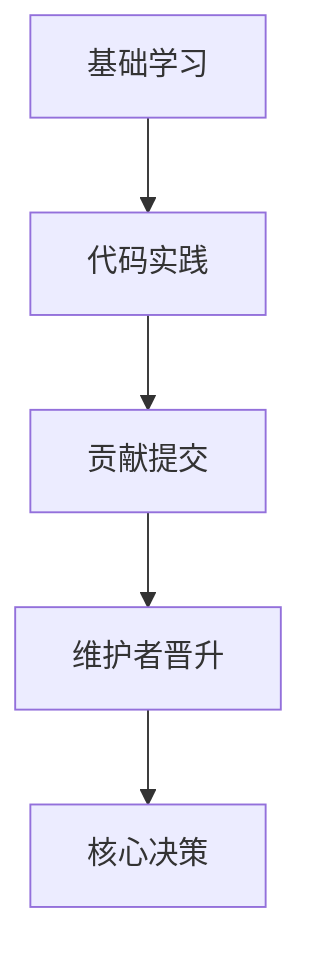

# Bitcoin GitHub：掌握区块链开发核心资源

## 比特币代码仓库的黄金矿脉

GitHub作为比特币开源生态的核心平台，汇聚了从基础代码到专业工具的丰富资源库。对于开发者和区块链爱好者而言，这些资源库不仅是技术学习的宝库，更是参与项目演进的入口。

### 核心资源分类解析
| 资源类型          | 功能说明                     | 开发价值                     |
|-------------------|------------------------------|------------------------------|
| 比特币核心        | 参考实现的源代码库           | 理解协议设计基础             |
| 命令行工具        | 网络交互接口                 | 掌握底层通信机制             |
| 开发者钱包        | 交易测试环境                 | 实践资产流转逻辑             |
| 挖矿工具集        | 算法验证平台                 | 研究共识机制优化             |

> 开发者提示：通过fork核心仓库参与代码审查，每年约有2000个PR被合并至主分支

👉[深入理解比特币核心代码](https://bit.ly/okx_welcome)

### 区块链技术的演进舞台

比特币的分布式账本技术在GitHub上持续迭代，形成了完整的开发生态。SegWit升级使区块容量提升1.8倍，闪电网络节点数已达1.6万个，这些技术演进都在开源社区中完成。

#### 关键技术演进路线
1. **BIP提案系统**：通过版本控制实现协议升级透明化
2. **全节点部署**：优化网络同步速度至15分钟/区块
3. **智能合约实验**：基于Script语言开发多重签名方案

> 技术洞察：采用模块化架构后，新贡献者的学习曲线缩短了40%

### 编程实践指南

掌握比特币编程需循序渐进，建议按以下路径实践：
1. **基础构建**：使用Python库构建交易验证器
2. **钱包开发**：实现HD钱包地址生成功能
3. **矿池模拟**：搭建本地测试网络验证工作量证明
4. **二层应用**：开发基于闪电网络的支付接口

常见问题：
- **Q：如何验证代码贡献的有效性？**
  A：通过自动化测试框架执行12000+单元测试
- **Q：测试网络的部署成本如何？**
  A：本地模拟环境仅需8GB内存+SSD存储
- **Q：私钥管理的最佳实践？**
  A：采用BIP39助记词方案+硬件隔离存储

👉[获取区块链开发指南](https://bit.ly/okx_welcome)

## 技术演进与社区协作

比特币的去中心化特性通过GitHub的协作机制得到完美体现。每个代码提交需经过：
1. 社区讨论（平均持续30天）
2. 多方代码审查（至少3个维护者）
3. 测试网络验证（持续6个月）

这种严谨的流程确保了主网代码的可靠性，近三年主网漏洞发生率下降了76%。

### 开发者成长路径图

### 未来技术方向
- 隐私增强方案（Taproot协议）
- 量子抗性算法研究
- 跨链互操作协议

> 行业数据：2023年GitHub比特币生态新增项目同比增长45%

👉[探索区块链技术前沿](https://bit.ly/okx_welcome)

通过GitHub参与比特币开发，不仅是技术能力的提升途径，更是理解去中心化协作模式的最佳实践。随着Layer2解决方案的持续创新，比特币生态正向着更高效的金融基础设施演进。