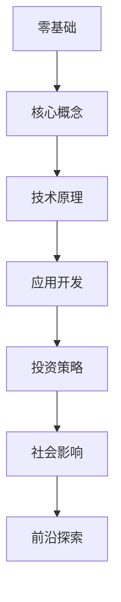

# 比特币书籍推荐与深度解析

## 比特币阅读指南：从零基础到精通的必读书单

在数字金融快速演变的当下，比特币作为去中心化金融的基石，已成为全球投资者和技术爱好者关注的焦点。本指南精选112本优质比特币书籍，涵盖技术原理、投资策略、社会影响三大维度，助您构建系统性认知体系。

---

### 一、零基础入门篇：揭开比特币神秘面纱

对于初探加密领域的读者，建议优先阅读以下通俗易懂的入门书籍：

1. [**《比特币：未来货币的诞生》**](https://thebitcoinhole.com/books/bitcoin-and-the-future-of-money)  
   - 作者：Jose Pagliery  
   - 核心价值：用生活化案例解析比特币运作机制，揭示区块链技术如何重构金融体系。

2. [**《比特币入门指南》**](https://thebitcoinhole.com/books/introduction-to-bitcoin)  
   - 作者：Florin T. Hilbay  
   - 独特视角：通过10个核心概念阶梯式教学，适合碎片化学习场景。

👉 [立即获取比特币入门手册完整版](https://bit.ly/okx_welcome)

3. **《比特币与加密货币技术全解》**  
   - 多作者联合编写  
   - 技术亮点：配套在线实验平台，支持读者模拟搭建简易区块链网络。

**学习建议**：配合[比特币白皮书](https://bitcoin.org/bitcoin.pdf)同步阅读，建立基础概念框架。

---

### 二、技术进阶篇：解密区块链底层架构

面向开发者和IT从业者的进阶书单，深入探讨协议设计与工程实践：

| 排名 | 书名                          | 核心技术覆盖领域          | 适用读者背景       |
|------|-------------------------------|---------------------------|--------------------|
| 33   | 《闪电网络精要》              | 二层扩展解决方案          | 熟悉密码学基础     |
| 102  | 《精通比特币》                | 挖矿算法与钱包开发        | 具备Python编程能力 |
| 83   | 《Groking比特币》             | 分布式系统原理            | 有计算机科学背景   |

**技术趋势洞察**：  
当前比特币二层网络开发呈现三大方向：  
1. 闪电网络支付通道优化（参考《Mastering the Lightning Network》）  
2. 侧链跨链技术突破（如Blockstream的Liquid网络）  
3. 零知识证明隐私增强方案（参见《Cryptoeconomics》）

---

### 三、投资理财篇：把握加密资产配置策略

专业投资者必读书籍清单及核心观点提炼：

- **《比特币标准》**（Saifedean Ammous）  
  提出"货币的稀缺性决定价值"理论，类比黄金储备体系分析比特币2100万总量上限的经济意义。

- **《法定货币的陷阱》**（Lawrence H. White）  
  通过历史案例揭示法币超发对购买力的侵蚀，论证比特币作为"硬通货"的抗通胀属性。

- **《加密资产继承规划》**（Pamela Morgan）  
  创新性提出"多重签名遗产池"方案，解决私钥托管的法律与技术难题。

投资误区警示：  
✅ 避免单一资产集中  
✅ 警惕杠杆交易风险  
✅ 定期评估资产配置比例  

👉 [查看专业加密资产配置模型](https://bit.ly/okx_welcome)

---

### 四、社会影响篇：重构数字时代的信任体系

探讨比特币对经济、政治和社会结构的深层影响：

- **《比特币与美国梦》**  
  分析发展中国家如何利用比特币突破资本管制，实现跨境支付自由化。

- **《比特币：重新定义主权》**（Knut Svanholm）  
  提出"数学主权"概念，论述代码规则如何超越国家法律的地域限制。

- **《比特币与黑人美国》**（Isaiah Jackson）  
  通过社区案例研究，展示比特币在少数族裔经济赋权中的实际应用。

---

## 常见问题解答

### Q1：如何选择适合自己的比特币书籍？
A：建议遵循"3W"原则：What（明确学习目标）→ Why（确定需求动机）→ Which（对应书籍类型）。技术爱好者优先选《精通比特币》，投资者推荐《比特币标准》，普通读者可从《比特币：未来货币的诞生》入门。

### Q2：比特币书籍是否适合零基础读者？
A：部分专业书籍（如《比特币协议分析》）需要技术背景，但超过60%的入选书籍针对非专业读者。建议选择带"Beginner's Guide"标识的读物，如《A Beginner's Guide To Bitcoin》。

### Q3：哪些书籍深入讲解比特币技术原理？
A：重点推荐《Bitcoin Internals》（Chris Clark）、《Mastering Bitcoin》（Andreas Antonopoulos）和《Grokking Bitcoin》（Kalle Rosenbaum），三本书分别从协议层、应用层和系统层进行深度解析。

### Q4：比特币书籍的时效性如何保障？
A：排名前20的经典著作（如《Digital Gold》）持续更新版本，反映行业最新动态。技术类书籍建议选择2023年后出版的版本，如《Layered Money》（Nik Bhatia）。

---

## 比特币阅读进阶路线图

**学习路径建议**：  
1. 第1-3月：完成2本入门书籍+1本技术基础书籍  
2. 第4-6月：精读1-2本投资专著+参与开源项目  
3. 第7-12月：研读政策研究报告+撰写技术博客

---

### 结语：构建您的比特币知识体系

通过系统性阅读与实践，您将掌握：  
🔹 比特币协议的密码学原理  
🔹 区块链网络的共识机制  
🔹 加密资产的配置方法论  
🔹 去中心化金融的演进趋势  

👉 [立即获取比特币学习路线图PDF](https://bit.ly/okx_welcome)