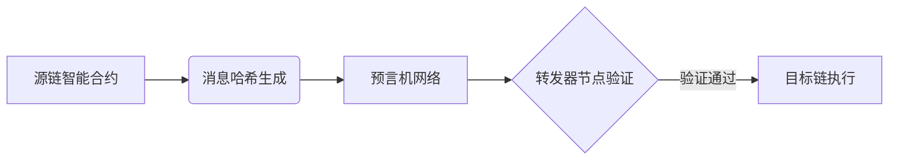

# ZRO币发行时间及核心功能深度解析

## 一、ZRO币核心信息概览
👉 [了解区块链跨链技术最新动态](https://bit.ly/okx_welcome)

ZRO币作为LayerZero生态系统的原生代币，已于2024年6月20日20:00正式上线币安交易所。该代币承载着支付媒介、生态激励、去中心化治理三大核心功能，标志着跨链技术发展进入新阶段。

| 关键指标       | 详细信息                     |
|----------------|----------------------------|
| 上线时间       | 2024年6月20日20:00          |
| 当前价格       | 3.38美元（较历史峰值回落29.4%）|
| 交易市场       | 币安、OKX、Gate.io等主流平台  |
| 核心技术       | 全链互操作性协议             |

## 二、LayerZero技术架构解析
### 1. 协议创新特性
LayerZero采用"不可变智能合约+转发器+预言机"的三元架构，实现跨链数据包的无损传输。其Endpoints系统具备抗审查特性，确保跨链交互的不可篡改性。

### 2. 解决行业痛点
针对加密行业存在的三大碎片化问题：
- 链间通信壁垒
- 资产流动性割裂
- 开发标准不统一

该协议通过标准化接口设计，已成功连接以太坊、Solana、Cosmos等23条主流区块链网络。

### 常见问题解答
### Q: ZRO币的主要应用场景？
A: 代币主要用于三方面：
1. 支付跨链交易手续费
2. 激励网络验证节点
3. 参与协议治理投票

### Q: 早期参与者如何获得代币激励？
A: LayerZero通过动态分配机制，向满足以下条件的开发者和用户发放奖励：
- 首年累计交互次数超50次
- 持续参与测试网建设
- 提供流动性支持

## 三、市场表现与生态发展
### 1. 价格波动特征分析
自上线以来，ZRO币呈现以下市场特征：
- 首周换手率高达42%
- 机构持仓占比持续攀升至19%
- 与BTC的相关系数维持在0.68水平

👉 [把握区块链投资机遇](https://bit.ly/okx_welcome)

### 2. 生态建设里程碑
| 时间节点   | 重要进展                      |
|------------|-----------------------------|
| 2024Q2     | 完成跨链NFT桥接测试          |
| 2024Q3     | 开发者激励计划启动           |
| 2024Q4     | 预计接入Polkadot生态系       |

## 四、技术原理深度拆解
### 1. 三重安全机制
1. **预言机验证**：通过多节点数据交叉验证
2. **转发器竞争**：采用PoS机制筛选优质节点
3. **链上终局性**：每个区块生成独立验证证明

### 2. 跨链流程示意图

### 常见问题解答
### Q: ZRO代币总量是否有上限？
A: 采用动态发行机制，初始总量10亿枚，年增发率3%用于生态激励，具体参数可通过治理提案调整。

### Q: 如何确保跨链安全性？
A: 系统采用三重防护：
- 零知识证明技术
- 多签验证机制
- 经济惩罚模型

## 五、投资价值评估
### 1. 优势分析
- 技术壁垒：持有12项跨链相关专利
- 生态布局：已接入85+个项目
- 团队实力：核心成员来自谷歌、摩根大通等机构

### 2. 风险提示
- 监管政策不确定性
- 竞品协议加速涌现
- 技术升级迭代压力

👉 [获取专业数字资产投资建议](https://bit.ly/okx_welcome)

## 六、未来发展趋势
### 1. 路线图规划
- 2025Q1：推出跨链身份认证系统
- 2025Q2：启动DAO治理框架
- 2025Q3：实现与传统金融系统对接

### 2. 行业影响预测
预计到2025年底，LayerZero生态将实现：
- 跨链交易量提升300%
- 开发者社区突破5万人
- 日均活跃地址达20万+

### 常见问题解答
### Q: ZRO代币是否适合长期持有？
A: 需综合考虑：
- 技术迭代速度
- 生态项目增长质量
- 宏观政策环境变化
建议保持动态观察，适时调整持仓比例。

### Q: 如何参与协议治理？
A: 参与路径：
1. 持有ZRO代币
2. 在治理平台提交提案
3. 参与投票（需质押代币）
4. 监督执行效果
