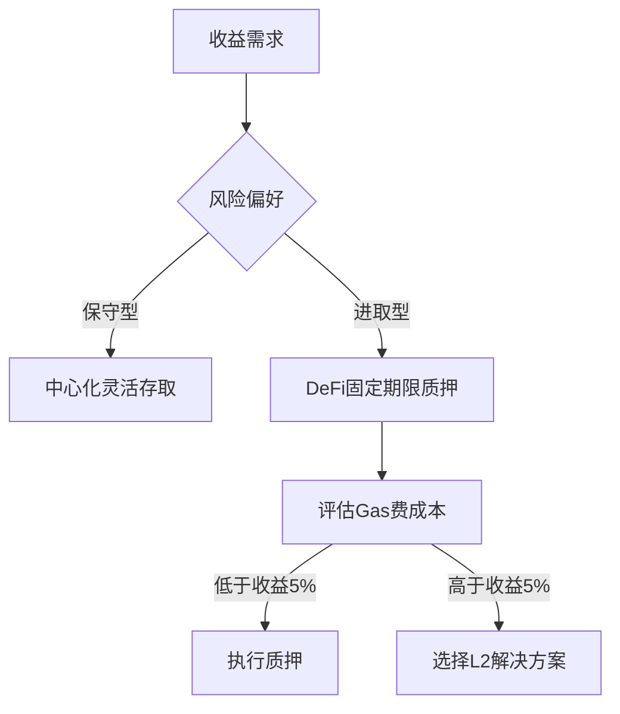

# 全面指南：如何赚取Maker（MKR）并最大化加密质押与借贷收益

## 一、MKR的核心价值解析
Maker（MKR）作为DeFi领域的重要治理代币，其价值与去中心化稳定币DAI深度绑定。通过以下维度可全面理解其独特性：

1. **治理权属性**  
   MKR持有者可参与协议升级、风险参数调整等决策，直接决定DAI的发行机制和系统运行规则。

2. **动态供需平衡机制**  
   - 通过稳定性费用调节DAI的发行成本
   - 收取的费用自动回购并销毁MKR，形成通缩模型
   - 当抵押品价值波动时，系统自动触发清算程序维持稳定

3. **DeFi基础设施地位**  
   DAI作为以太坊生态核心稳定币，日均交易量超10亿美元，MKR作为其治理载体间接支撑着整个DeFi生态的流动性。

👉 [查看最佳收益平台](https://bit.ly/okx_welcome)

## 二、MKR技术架构解析
基于以太坊的智能合约系统构建了完整的金融基础设施：

| 模块           | 核心功能                          | 技术特性                     |
|----------------|-----------------------------------|------------------------------|
| 担保金金库     | 用户质押ETH生成DAI                | 抵押率需维持150%以上         |
| 价格预言机     | 实时监控抵押资产价格              | 多节点数据聚合防止单点失效   |
| 治理模块       | 投票决定稳定性费用等关键参数      | 多签合约+时间锁机制保障安全  |
| 回购销毁系统   | 用协议收益自动回购MKR并销毁       | 动态算法匹配市场供需变化     |

前端交互方面，主流DeFi聚合平台通过Web3.js/ethers.js实现链上数据实时同步，采用GraphQL优化高频数据查询，确保用户界面响应速度控制在200ms以内。

## 三、MKR收益策略全解析

### 1. 中心化平台收益方案
主流交易所提供灵活存取和固定期限产品：

**灵活存取方案**（年化收益率）：
- Gate.io：4.38%
- YouHodler：7%
- OKX：1%

**固定期限方案**（年化收益率）：
- XT.COM（30天）：1.5%
- WhiteBIT（360天）：4.69%

👉 [获取最新收益数据](https://bit.ly/okx_welcome)

### 2. 去中心化协议收益途径
通过DeFi协议参与流动性挖矿：
- **Compound**：年化0.4%，需注意ETH网络gas费
- **Bancor V3**：年化0.12%，支持自动复利
- **Fraxlend**：年化6.03%，采用算法利率模型

### 3. 深度参与MakerDAO生态
- 开设CDP金库质押ETH生成DAI，间接获取系统收益
- 参与治理投票获取空投奖励
- 提供预言机数据服务获得手续费分成

## 四、风险控制策略

### 1. 收益波动性管理
- 组合配置：将70%资金投入低风险灵活产品，30%配置高收益固定期限
- 分散持仓：在3个以上平台分配资金，避免单一平台风险
- 动态调整：每季度根据市场利率变化重新配置资产

### 2. 技术风险防范
- 使用硬件钱包存储长期资金
- 审核智能合约地址：通过区块链浏览器验证合约代码
- 启用二层验证：所有中心化平台必须绑定2FA

### 3. 市场风险对冲
- 保持30%流动性应对极端行情
- 通过期权市场对冲MKR价格波动风险
- 关注ETH网络拥堵情况，避开gas费高峰时段操作

## 五、实战操作指南

### 步骤1：平台选择决策树


### 步骤2：收益测算工具
使用复利计算器评估不同方案：
```
期末金额 = 本金 × (1 + 年化收益率/计息周期)^总周期数
```
示例：1000 MKR存入WhiteBIT 360天产品
```
期末金额 = 1000 × (1 + 4.69%/365)^365 ≈ 1048.12 MKR
```

### 步骤3：收益跟踪系统
建议配置自动化监控方案：
1. 使用TradingView设置价格提醒
2. 在Dune Analytics创建收益仪表盘
3. 启用Telegram通知机器人实时推送收益变动

## 六、常见问题解答（FAQ）

**Q1：MKR质押是否需要承担价格波动风险？**  
A：是的，质押收益以MKR计价，但实际价值受市场价格波动影响。建议将年化收益维持在价格波动率的1.5倍以上。

**Q2：如何选择DeFi平台？**  
A：优先选择通过CertiK、Hacken审计的协议，查看TVL（总锁定价值）是否稳定增长，避免新上线的高收益项目。

**Q3：Gas费对收益有何影响？**  
A：在以太坊主网操作时，当Gas费超过200Gwei时，小额质押收益可能被手续费抵消。建议使用Arbitrum等L2网络降低成本。

**Q4：如何参与治理投票？**  
A：需持有至少1%的流通MKR才能发起投票，普通用户可通过委托平台参与重大提案表决。

**Q5：MKR的通缩模型如何影响价格？**  
A：根据历史数据，每次大规模销毁后MKR价格平均上涨8-12%，但需结合整体市场行情综合判断。

## 七、收益优化进阶策略

### 1. 动态再平衡策略
- 每月检查各平台收益率变化
- 当利率差异超过1.5%时执行资金转移
- 使用跨链桥接实现多生态收益捕获

### 2. 复利效应强化
选择支持自动复投的协议（如Bancor V3），通过指数增长提升最终收益。以年化5%为例，连续复投5年可产生27.6%的超额收益。

### 3. 治理套利机会
在重大提案投票前增持MKR，获取短期治理奖励，投票结束后转为质押获取基础收益，年化收益可提升2-3个百分点。

👉 [获取实时收益数据](https://bit.ly/okx_welcome)

## 八、行业趋势展望
随着以太坊升级完成，DeFi生态进入新阶段：
1. Layer2解决方案将gas费降低90%，推动小额质押普及
2. RWA（现实资产代币化）或成为MKR新应用场景