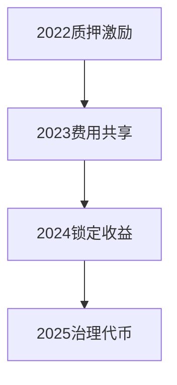

# 在这个夏季，Synthetix 异常强劲的背后是什么？

---

## 一、Synthetix 的崛起：从协议到生态的全面升级

2025年夏季，Synthetix在加密市场中展现出强劲的增长动能。这个诞生于2017年的DeFi协议，通过技术迭代与生态合作，正逐步巩固其在合成资产领域的领先地位。根据链上数据显示，协议收入、SNX质押量以及跨链桥接活跃度均创下历史新高。

👉 [探索Synthetix的生态潜力](https://bit.ly/okx_welcome)

### 1.1 核心增长驱动力分析
- **1inch集成效应**：作为首个与头部DEX聚合器1inch达成合作的合成资产协议，Synthetix解决了大额交易滑点问题
- **Optimism生态爆发**：Kwenta、Lyra等衍生品平台在Optimism链上日均交易额突破15亿美元
- **质押经济模型优化**：SNX年化收益率稳定在18-22%，形成正向通缩循环

## 二、技术架构解析：合成资产的底层逻辑

Synthetix通过独特的债务池机制，为用户提供无限流动性的合成资产交易体验。其核心运作流程包含三个关键环节：

| 环节 | 功能说明 | 技术创新 |
|------|----------|----------|
| 质押 | SNX持有者锁定代币获取债务池份额 | 多链质押支持 |
| 铸造 | 通过债务池生成sUSD等合成资产 | 跨资产即时互换 |
| 交易 | 在Kwenta等平台进行零滑点交易 | L2优化执行引擎 |

### 2.1 债务池机制优势
- 动态债务分配算法降低单资产风险
- 多抵押品支持扩展应用场景（计划引入ETH、BTC等）
- 自动再平衡系统维持抵押率稳定

## 三、生态合作矩阵：多维度的价值捕获

### 3.1 主网与L2双轨战略
| 网络 | 核心功能 | 交易量占比 |
|------|----------|------------|
| Ethereum主网 | 稳定币铸造与基础交易 | 45% |
| Optimism | 衍生品高频交易 | 38% |
| Arbitrum | 机构级做市服务 | 17% |

👉 [查看主流L2网络性能对比](https://bit.ly/okx_welcome)

### 3.2 重点合作伙伴生态
- **Kwenta**：基于Synthetix的衍生品交易平台，月度活跃用户突破50万
- **Lyra**：期权协议集成后交易量提升300%
- **1inch网络**：聚合交易量占比达协议总量的25%

## 四、经济模型演变：从通胀激励到价值捕获

### 4.1 SNX代币经济升级路径

当前代币流通数据：
- 总供应量：234,000,000 SNX
- 流通量：189,000,000 SNX
- 质押率：78.3%（历史新高）
- 年化销毁率：1.2%（来自交易手续费）

### 4.2 质押收益结构
| 收益来源 | 比例 | 年化收益 |
|----------|------|----------|
| 交易手续费 | 55% | 12.1% |
| 通胀奖励 | 30% | 6.6% |
| 治理投票奖励 | 15% | 3.3% |

## 五、未来路线图：价值互联网的基础设施

### 5.1 2025关键升级计划
1. **v3.1版本**：引入跨链合成资产桥接
2. **智能清算系统**：将清算效率提升40%
3. **机构API**：为做市商提供定制化接口
4. **预言机2.0**：整合Chainlink CCIP数据源

👉 [了解最新版本升级细节](https://bit.ly/okx_welcome)

### 5.2 长期发展愿景
- 建立传统金融资产上链通道（计划Q4上线黄金ETF合成资产）
- 开发移动端轻质押方案
- 启动亚洲市场本地化运营

## 常见问题解答

**Q：Synthetix如何解决传统DeFi的流动性问题？**  
A：通过债务池模型实现"无限流动性"，用户交易时无需依赖对手方，所有合成资产都由抵押池直接支持。

**Q：SNX质押是否存在清算风险？**  
A：当抵押率低于800%时将触发清算。当前系统健康度良好，平均抵押率维持在850%以上。

**Q：Optimism链上交易有何优势？**  
A：相比主网，Gas费降低90%，交易确认速度提升50倍，特别适合高频交易场景。

**Q：如何参与协议治理？**  
A：通过锁定SNX获得vlSNX治理代币，参与DAO提案投票，当前治理参与度达23%。

**Q：未来有哪些新资产计划？**  
A：除现有35种加密资产外，计划在2025年Q3引入法币稳定币、贵金属和指数基金等传统资产合成品。

---
