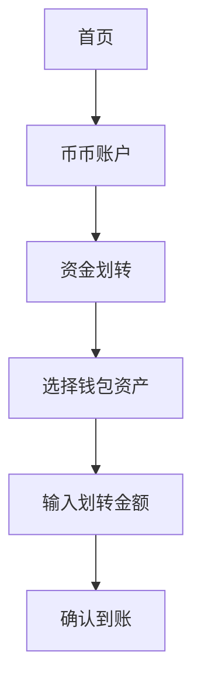

# 欧易OKEx币币交易全流程指南

## 一、币币交易核心认知
币币交易作为数字资产流通的核心方式，指通过已持有数字货币兑换其他币种的交易形式。以BTC/USDT交易对为例，投资者可用比特币按实时汇率兑换稳定币，其交易撮合机制遵循"价格优先、时间优先"原则，支持限价单、市价单等多种委托类型。

> **核心价值**：相较法币交易，币币交易具备更低手续费（平均0.1%）、更高流动性（日均交易额超500亿美元）及跨链资产配置优势。

## 二、电脑端交易实战教程
### 1. 账户准备阶段
- 访问官网完成注册认证（[立即注册账户](https://bit.ly/okx_welcome)）
- 完成邮箱/手机双重验证
- 设置资金密码与谷歌验证双重保障

### 2. 交易界面解析
| 区域 | 功能说明 | 操作建议 |
|------|----------|----------|
| 币种选择栏 | 支持BTC/ETH/USDT等主流交易区 | 新手优先选择USDT交易区 |
| 深度行情图 | 实时展示买卖盘口数据 | 关注挂单量突变信号 |
| 委托面板 | 提供限价单/市价单/冰山订单 | 波动市场建议使用限价单 |

### 3. 限价单交易实操
1. 选择BTC/USDT交易对
2. 输入目标价格（如当前市价$30,000时设置$29,800买入）
3. 填写数量（最低0.001 BTC）
4. 确认手续费预览（买入0.1%/卖出0.1%）
5. 点击「买入BTC」完成挂单

👉 [下载OKX专业版交易工具](https://bit.ly/okx_welcome)

## 三、移动端交易进阶指南
### 1. 资金划转流程

### 2. 移动端特色功能
- 指纹/面容ID快速登录
- 行情提醒自定义设置
- 短线交易快捷面板
- 多设备同步持仓数据

### 3. 市价单操作要点
1. 进入「BTC/USDT」交易页
2. 点击「市价快速买入」
3. 选择「可用USDT全额买入」
4. 确认滑点提示（通常≤0.5%）
5. 交易完成即时查看持仓

## 四、交易策略与风险管理
### 常见订单类型对比
| 类型 | 适用场景 | 优势特点 | 风险提示 |
|------|----------|----------|----------|
| 限价单 | 精准价格建仓 | 成本可控 | 可能无法成交 |
| 市价单 | 紧急行情入场 | 快速响应 | 存在滑点风险 |
| 止盈止损单 | 风险对冲 | 自动化风控 | 需合理设置点位 |

### 新手常见问题解答
**Q：交易手续费如何计算？**  
A：采用阶梯费率制度，月交易量≥50 BTC可享0.02%超低费率

**Q：资金划转需要多久？**  
A：链上确认通常3-10分钟，法定节假日可能延迟30%

**Q：如何选择优质交易对？**  
A：建议关注日成交量前50名币种，避免低流动性品种

**Q：挂单未成交如何处理？**  
A：可使用「高级限价单」设置自动追单功能

👉 [获取2024加密资产投资白皮书](https://bit.ly/okx_welcome)

## 五、安全与合规操作规范
1. 开启双重验证（邮箱+手机+谷歌验证）
2. 设置IP登录异常提醒
3. 定期检查资金划转记录
4. 遵守所在国数字资产监管政策
5. 使用硬件钱包存储大额资产

### 交易异常处理流程
- 网络中断：自动挂单保护机制生效
- 价格剧烈波动：系统强制平仓阈值为85%
- 账户异常登录：立即冻结资产并重置密码

通过本指南系统学习，投资者可掌握从基础操作到高级策略的完整交易体系。建议新手先通过模拟交易熟悉市场，逐步建立适合自己的投资模型。数字资产市场机遇与风险并存，理性投资方能行稳致远。